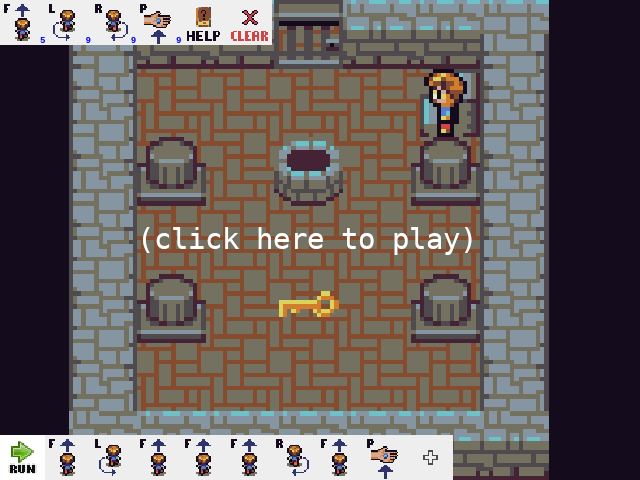

# game-robot-puzzle
Simple web game where you control robot using simple instructions (forward, left, right, repeat,. pick, drop, ...) to solve logical puzzles

### Support

You can support development on [Patreon](https://www.patreon.com/DusanHalicky) or you can hire me via [Upwork](https://www.upwork.com/freelancers/~013b4c3d6e772fdb01)

